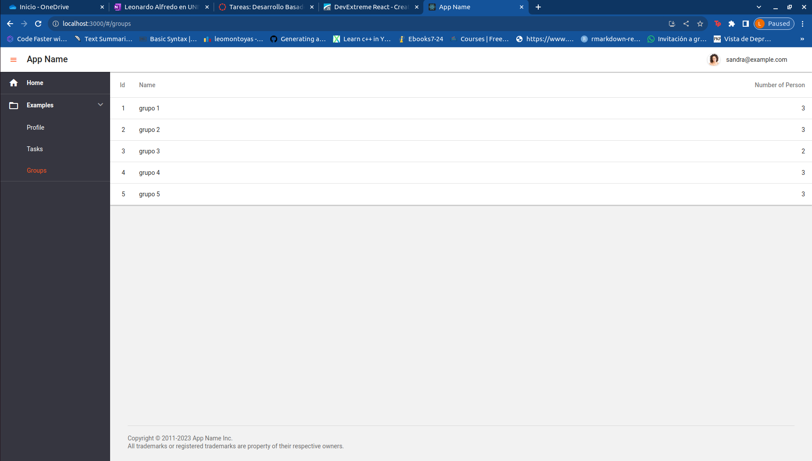
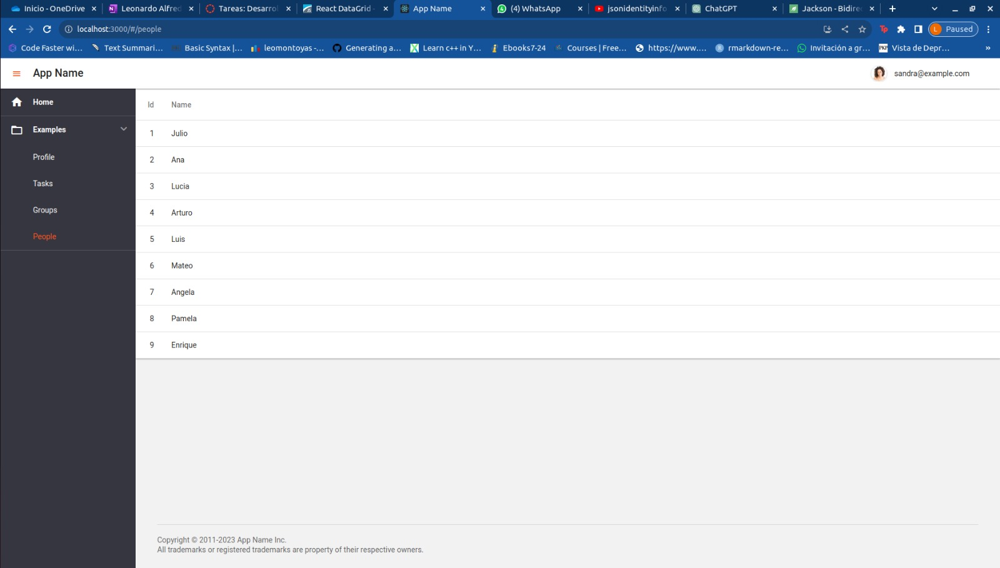
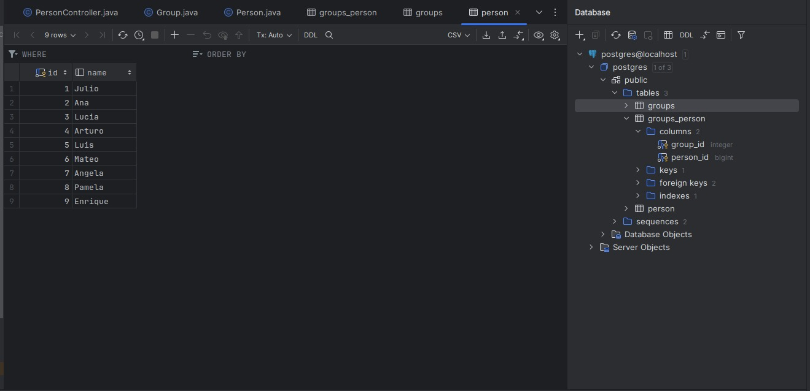
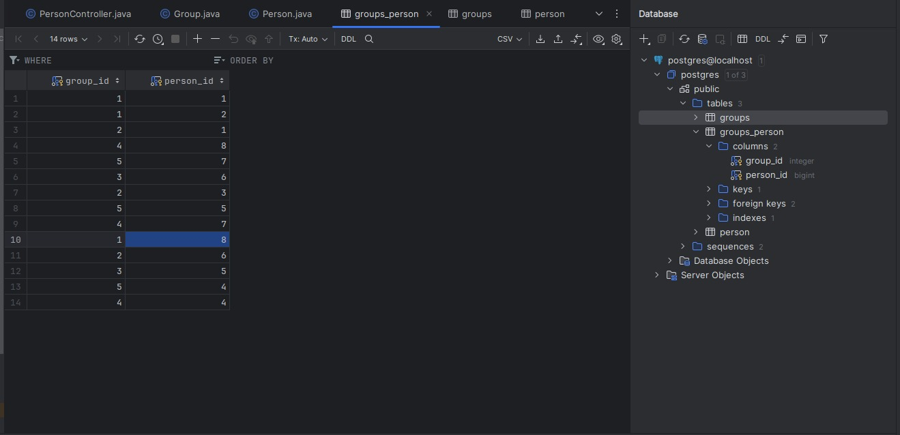

# hackaton4
## Visualización de la página utilizando Header  , consumiendo la api de  grupos y personas

Se  Utilizo react para poder  desarrollar el consumo de la Api y ademas poder  colocar Header  ID ,  nombre del grupo y cantidad de participantes una ves  obtenido el modelo  .

Además del anterior resultado se mostró la lista de personas registradas.

valores almacenados para grupo

valores  almacenados para persona  

Tabla intermedia creado por las relaciones de las entidades  grupos y persona  

