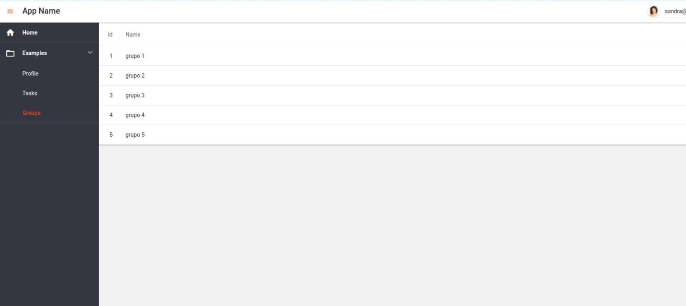
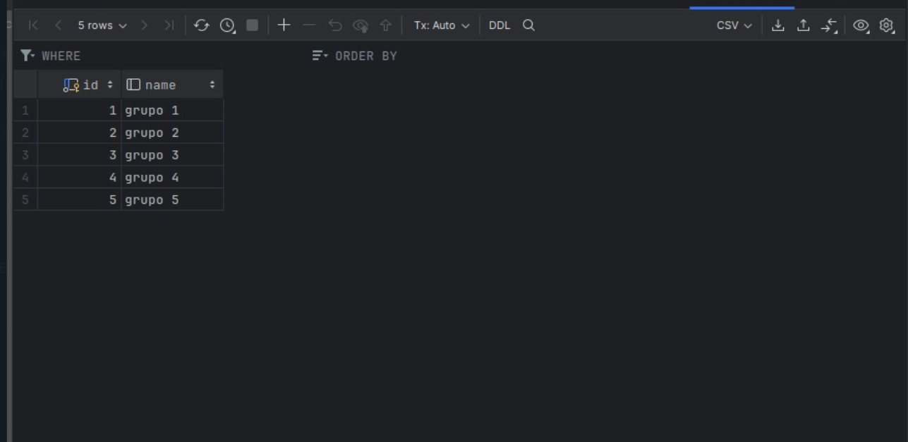

# hackaton4
## Visualización de la página utilizando Header  , consumiendo la api de  grupos y personas

Se  Utilizo react para poder  desarrollar el consumo de la Api y ademas poder  colocar Header  ID  y  Name    una ves  obtenido el modelo  .

Data valores almacenados para grupo

Data almacenada para persona  

